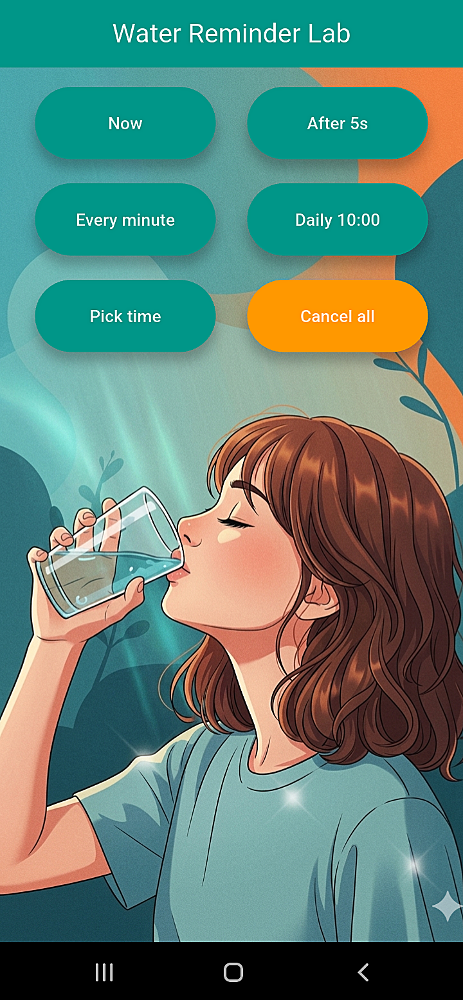
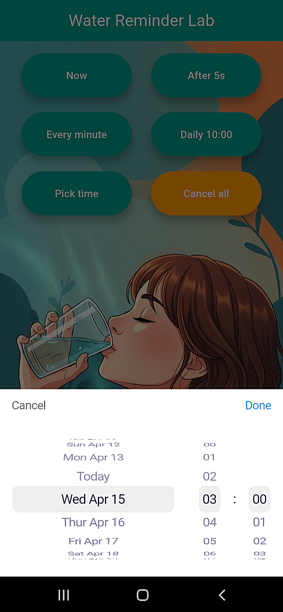
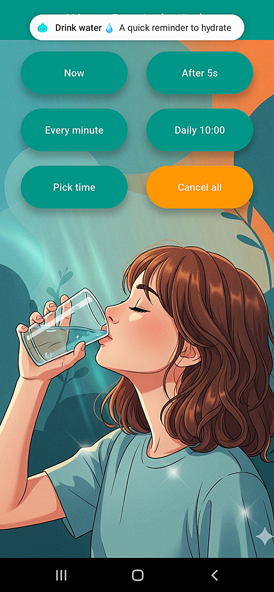
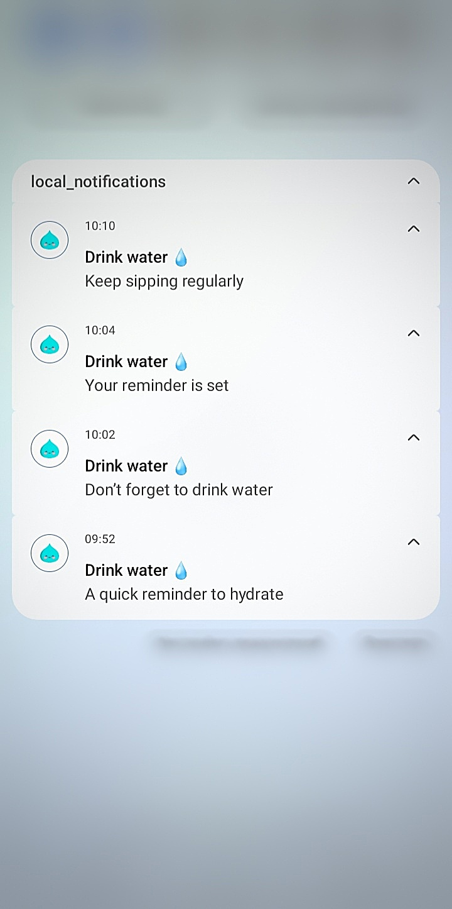

# 💧 Water Reminder

A Flutter app for reminding users to drink water regularly using local notifications.

## 📸 Demo 

<p>
  
  &nbsp;&nbsp;&nbsp;
  
</p>

<br>

<p>
  
  &nbsp;&nbsp;&nbsp;
  
</p>

## ✨ Features

- Instant notifications
- Daily scheduled reminders
- Periodic water intake reminders
- Cancel all notifications
- Automatic timezone support
- Notification permission handling (Android 13+)
- Fully offline operation (no internet or servers required)

## 🔧 Setup

<details>
<summary>Click to expand installation instructions</summary>

&nbsp;

1. Add dependencies in pubspec:

```yaml
dependencies:
  flutter:
    sdk: flutter
  flutter_local_notifications: ^21.0.0
  flutter_timezone: ^4.1.1
  timezone: ^0.11.0
  permission_handler: ^12.0.1
```

2. Android configuration  
android/app/build.gradle.kts

```kotlin
android {
    compileSdk = 36

    defaultConfig {
        targetSdk = 36
        multiDexEnabled = true
    }

    compileOptions {
        sourceCompatibility = JavaVersion.VERSION_17
        targetCompatibility = JavaVersion.VERSION_17
        isCoreLibraryDesugaringEnabled = true
    }

    kotlinOptions {
        jvmTarget = JavaVersion.VERSION_17.toString()
    }
}

dependencies {
    coreLibraryDesugaring("com.android.tools:desugar_jdk_libs:2.1.4")
    implementation("androidx.window:window:1.0.0")
    implementation("androidx.window:window-java:1.0.0")
}
```

3. AndroidManifest.xml setup  
android/app/src/main/AndroidManifest.xml

<br>

```xml
<uses-permission android:name="android.permission.POST_NOTIFICATIONS" />
<uses-permission android:name="android.permission.RECEIVE_BOOT_COMPLETED" />
<uses-permission android:name="android.permission.SCHEDULE_EXACT_ALARM" />
<uses-permission android:name="android.permission.VIBRATE" />
```

</details>

## 📦 Tech & Packages

- flutter_timezone: ^4.1.1
- timezone: ^0.11.0
- flutter_datetime_picker_plus: ^2.2.0
- permission_handler: ^12.0.1

## 🛠️ Installation & Running

```bash

git clone https://github.com/Ks577/water-reminder-app-local-notifications-flutter.git
cd water-reminder-app-local-notifications-flutter
flutter pub get
flutter run
```
